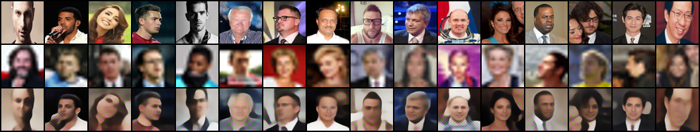

# Image Artifact Generation with a Variational Autoencoder (VAE)

This project uses a Variational Autoencoder (VAE) to generate images that combine the content of one image with the style of another. It is highly inspired by `Exploiting Style and Attention in Real-World Super-Resolution` by [(Ma et al., 2019)](https://arxiv.org/abs/1912.10227). The original idea was to develop a method for reproducing more natural low-resolution images, which could theoretically help super-resolution models generalize better. However, due to hardware limitations, I was unable to reproduce the results of Ma et al., though overall, the model appears to be on the right track.

<div style="display: flex; justify-content: center;">
  
</div>

## Model Architecture

The model consists of three main components:

*   **High-Resolution Encoder (`EncoderHR`):** Encodes the clean, high-resolution image to extract its content.
*   **Low-Resolution Encoder (`EncoderLR`):** Encodes the degraded, low-resolution image to extract its style.
*   **Decoder:** Combines the content and style representations to generate a new image.

The VAE is trained to reconstruct the high-resolution image while learning a latent distribution of the low-resolution image's style.

## Installation

1.  Clone the repository:
    ```bash
    git clone <repository-url>
    cd style-vae
    ```

2.  **Use virtual enviroment:**
    ```bash
    python3 -m venv .venv
    source .venv/bin/activate
    ```    

3.  Install the required dependencies:
    ```bash
    pip install -r requirements.txt
    ```

## Configuration

The training process can be configured using the `config.yaml` file. The following parameters are available:

*   `data_path`: Path to the directory containing the training data.
*   `num_epochs`: Number of training epochs.
*   `latent_dim`: Dimensionality of the latent space.
*   `batch_size`: Batch size for training.
*   `lr`: Learning rate for the optimizers.
*   `style_weight`: Weight for the style loss component.
*   `kl_weight`: Weight for the KL divergence loss component.
*   `mi_weight`: Weight for the mutual information loss component.
*   `checkpoint_dir`: Directory to save model checkpoints.

## Usage

To train the model, run the following command:

```bash
python train.py --config config.yaml
```

### Resuming Training

To resume training from a checkpoint, use the `--checkpoint` argument:

```bash
python train.py --config config.yaml --checkpoint checkpoints/checkpoint_epoch_10.pth
```

Replace `checkpoints/checkpoint_epoch_10.pth` with the path to your checkpoint file.